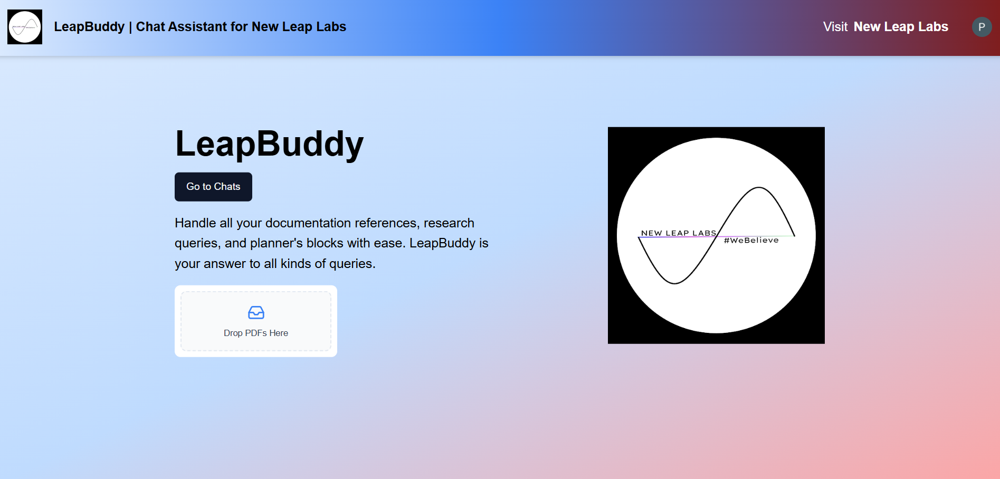
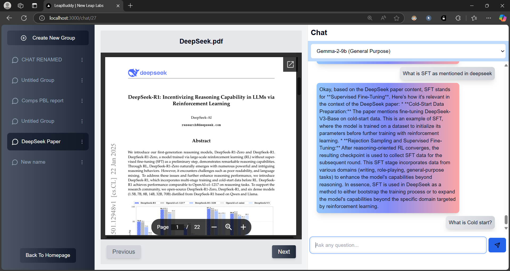

# LeapBuddy: RAG-based Chat Assistant for New Leap Labs

This is a Retrieval-Augmented Generation (RAG) based Chat Assistant, which uses Google Gemini as LLM and Embeddings, NeonDB as chat storage, AWS S3 as file storage, Pinecone as Vector Database and Next.JS framework.






## Getting Started

## Getting Started

First, ensure you have Node.js installed. You can download it from [Node.js official website](https://nodejs.org/), or install it via a package manager:
- **Windows**:  
  Download the Node.js installer from the [official Node.js website](https://nodejs.org/). Run the installer, follow the setup steps, and ensure you check the option to add Node.js to your system PATH during installation.

- **macOS**:  
  Install Node.js using Homebrew:
  ```bash
  brew install node
  ```
- **Linux**:  
  Install Node.js using terminal commands:
  ```bash
  sudo apt update
  sudo apt install -y nodejs npm
  ```

Install dependencies:

```bash
npm i --legacy-peer-deps
```

Then, acquire API keys for the following purposes (store them in a .env file in the main repository):
```bash
# Clerk Auth:
NEXT_PUBLIC_CLERK_PUBLISHABLE_KEY
CLERK_SECRET_KEY

# NeonDB: 
DATABASE_URL
DATABASE_HOST
DATABASE_PASS
DATABASE_USER
DATABASE_NAME
DATABASE_PORT

# AWS S3: 
NEXT_PUBLIC_S3_ACCESS_KEY_ID
NEXT_PUBLIC_S3_SECRET_ACCESS_KEY
NEXT_PUBLIC_S3_BUCKET_NAME

# Pinecone: 
PINECONE_ENVIRONMENT
PINECONE_API_KEY

# Gemini: 
GEMINI_API_KEY
```

Then, run the development server:
```bash
npm run dev
```

Open [http://localhost:3000](http://localhost:3000) with your browser to see the result.


